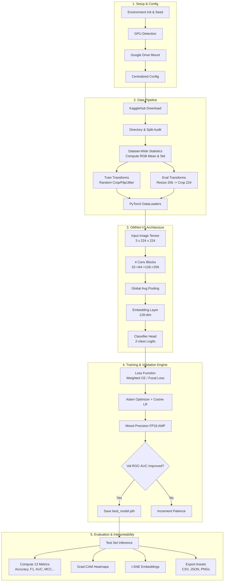
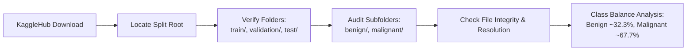
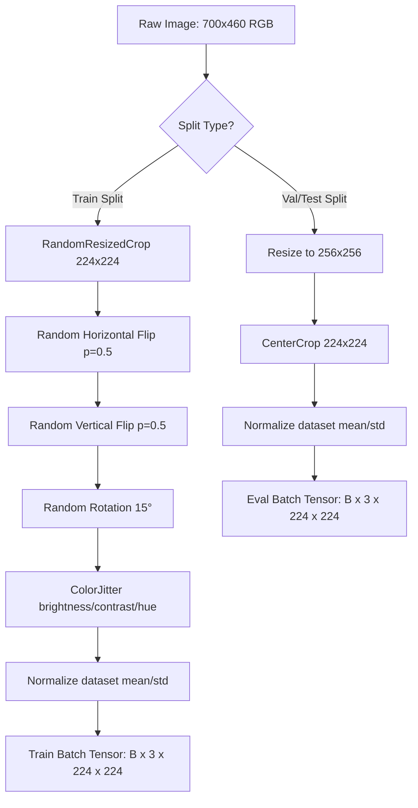
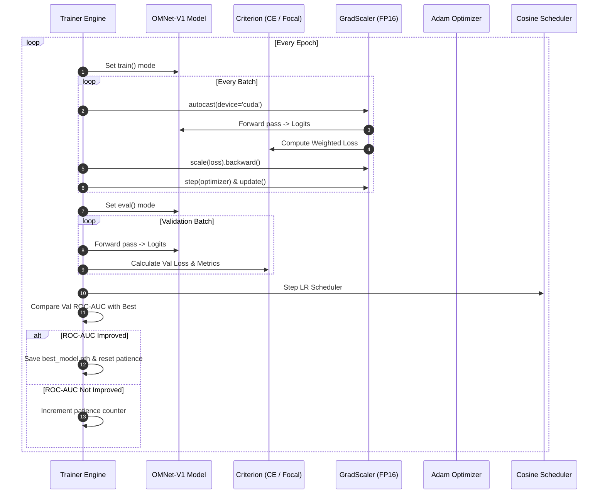
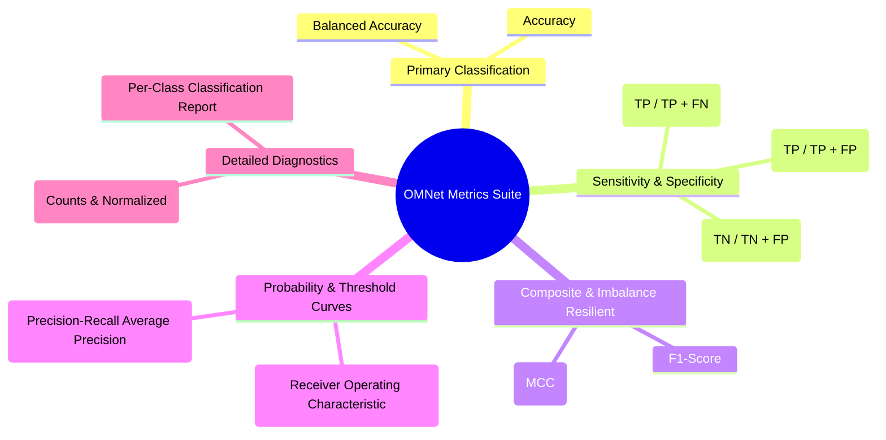
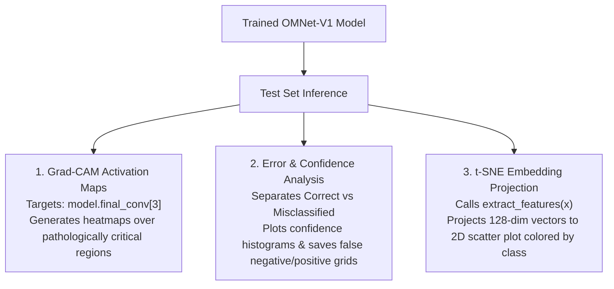
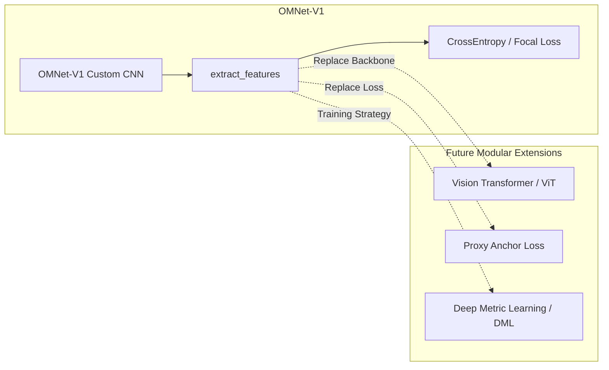

# OMNet Process Flow & Pipeline Documentation

This document provides a comprehensive, simplified, yet production-accurate process flow for the **OMNet** research framework on breast cancer histopathology image classification (BreakHis 400X).

---

## High-Level System Architecture

The following diagram illustrates the complete end-to-end pipeline from environment initialization to metric export and visual interpretability.



---

## 1. Setup & Centralized Configuration

### Process Flow
1. **Dependency Installation**: Install dynamic dependencies (`kagglehub`, `pytorch-grad-cam`).
2. **Deterministic Seed Allocation**: Seed `random`, `numpy`, `torch`, and CUDA backends (`cudnn.deterministic = True`).
3. **Hardware Assessment**: Queries `torch.cuda.get_device_properties(0)` for compute capability and memory capacity.
4. **Drive Mount & Workspace Pathing**: Mounts Google Drive (`/content/drive/MyDrive/OMNet/outputs`) with an automatic local fallback if non-Colab.
5. **Centralized Configuration (`CONFIG`)**: Central dictionary defining batch size, learning rates, loss functions, normalization mode, seed, and `smoke_test` toggle.

---

## 2. Dataset Ingestion & Validation

The dataset used is **BreakHis 400X** (`pankaj4321/breakhis-400x`), containing 1,693 histopathology microscopy images at 400× magnification.



### Key Verification Rules:
- **Zero Data Leakage / No Re-splitting**: The pre-split directory structure (`train/`, `validation/`, `test/`) is strictly preserved.
- **Corrupt File Interception**: Each image is opened with PIL to verify integrity prior to DataLoader creation.

---

## 3. Dataset-Specific Normalization Computation

Rather than using generic ImageNet statistics ($[0.485, 0.456, 0.406]$), OMNet computes the exact RGB mean and standard deviation across all training images to match the staining characteristics of histopathology images.

```mermaid
sequenceDiagram
    autonumber
    participant Loop as DataLoader Loop
    participant Image as Training Image
    participant Stat as Running Accumulator
    participant Output as Normalization Stats

    Loop->>Image: Read RGB Image (PIL)
    Image->>Stat: Convert to Tensor in [0, 1]
    Stat->>Stat: Accumulate Channel Pixel Sum
    Stat->>Stat: Accumulate Channel Pixel Squared Sum
    Stat->>Stat: Accumulate Total Pixel Count
    Loop->>Output: Calculate Final Mean & Std
```

$$\text{Mean}_c = \frac{\sum P_c}{N_{pixels}}, \quad \text{Std}_c = \sqrt{\frac{\sum P_c^2}{N_{pixels}} - (\text{Mean}_c)^2}$$

---

## 4. Data Processing & Augmentation Pipeline



---

## 5. OMNet-V1 Architecture & Modular Interfaces

OMNet-V1 is a custom 4-block CNN built from scratch. It decouples feature extraction from classification to ensure seamless future migration to **Vision Transformers**, **Deep Metric Learning**, and **Proxy Anchor Loss**.

```mermaid
graph TD
    Input[Input Tensor: B x 3 x 224 x 224] --> B1[ConvBlock 1: 3 -> 32\nConv2d -> BN -> ReLU -> Conv2d -> BN -> ReLU -> MaxPool -> Drop(0.25)]
    B1 --> B2[ConvBlock 2: 32 -> 64\nConv2d -> BN -> ReLU -> Conv2d -> BN -> ReLU -> MaxPool -> Drop(0.25)]
    B2 --> B3[ConvBlock 3: 64 -> 128\nConv2d -> BN -> ReLU -> Conv2d -> BN -> ReLU -> MaxPool -> Drop(0.25)]
    B3 --> B4[Final Conv Block: 128 -> 256\nConv2d -> BN -> ReLU -> Conv2d -> BN -> ReLU]
    B4 --> GAP[Global Average Pooling\nAdaptiveAvgPool2d(1)]
    GAP --> Flatten[Flatten -> B x 256]
    
    subgraph ModularInterface["Modular DML & Backbone Interface"]
        Flatten --> Embed[Linear(256 -> 128) + ReLU + Dropout(0.5)]
        Embed --> FeatureOut["extract_features(x)\nReturns B x 128 Embeddings"]
    end
    
    FeatureOut --> Head[Classifier: Linear(128 -> 2)]
    Head --> LogitsOut["forward(x)\nReturns B x 2 Class Logits"]
```

---

## 6. Training & Validation Execution Loop

The training engine (`Trainer`) integrates Automatic Mixed Precision (AMP), inverse-frequency class weighting, cosine learning rate decay, and validation-AUC early stopping.



---

## 7. Comprehensive Evaluation Metrics Suite

OMNet evaluates test performance across 13 holistic metrics:



---

## 8. Interpretability & Error Analysis Pipeline

To prevent "black-box" predictions, OMNet generates three visual diagnostic artifacts:



---

## 9. Output Artifact Structure

Every experiment run automatically exports structured assets into the `outputs/` directory:

```
outputs/
├── best_model.pth           # Full checkpoint of peak validation AUC epoch
├── last_model.pth           # Final epoch checkpoint
├── training_history.csv     # Epoch-by-epoch loss, metrics, LR, and time
├── metrics.csv              # Final test set evaluation metrics
├── experiment_summary.json  # Complete environment, config, and metric dump
├── confusion_matrix.png     # Counts and normalized confusion heatmaps
├── roc_curve.png            # ROC curve with AUC annotation
├── precision_recall.png     # Precision-Recall curve with AP annotation
├── training_curve.png       # 2x2 grid (Loss, Acc, LR, AUC vs Epochs)
├── tsne_embeddings.png      # 2D t-SNE plot of learned feature space
├── gradcam/                 # Grad-CAM overlay images
├── misclassified/           # Misclassified test samples with confidence
└── correct_predictions/     # Top high-confidence correct predictions
```

---

## 10. Future Extensibility Architecture



By leveraging `extract_features()` and `get_embedding_dim()`, future iterations (OMNet-V2, ViT, Proxy Anchor Loss) plug directly into the existing data loader, trainer, and evaluation suite without modifying the surrounding infrastructure.
