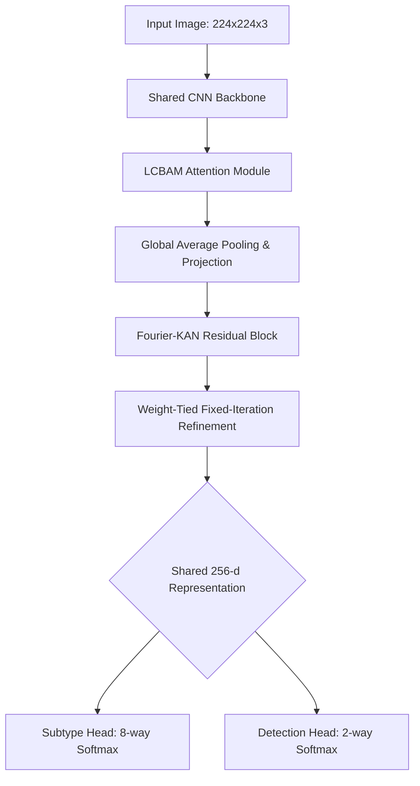

# OMNet V4 Architecture Knowledge Base

This document provides a comprehensive end-to-end breakdown of the OMNet V4 model architecture, specifically designed for Multi-Task Breast Histopathology Detection and Subtype Classification. It serves as a centralized reference for research purposes.

---

## 1. Overview and Scientific Motivation

**Core Objective:** To classify breast histopathology images (BreakHis dataset) into 8 sub-types (e.g., adenosis, fibroadenoma, ductal carcinoma, etc.) and perform binary detection (benign vs. malignant). 
**Key Innovation:** The architecture extends traditional CNN backbones with a Fourier-KAN (Kolmogorov-Arnold Network) residual block and a **weight-tied, fixed-iteration refinement stage**, approximating the representation power of Deep Equilibrium (DEQ) models without their inherent convergence instability and custom backward pass requirements.

---

## 2. Core Model Architecture Flow



### 2.1 Input and Shared CNN Backbone
* **Input Resolution:** `224x224x3` RGB image, normalized using standard ImageNet mean and standard deviation.
* **Backbone Options:** 
    * `densenet201` (Default) - Output Feature Dim: `1920-d`
    * `efficientnet_b0` (Fallback) - Output Feature Dim: `1280-d`
* **Pretraining:** Models are initialized with ImageNet pre-trained weights for transfer learning.

### 2.2 Lightweight Convolutional Block Attention Module (LCBAM)
Before global pooling, the backbone's feature maps are processed by the LCBAM module to highlight salient histopathological regions and suppress background artifacts.
* **Channel Attention:** Applies both Global Average Pooling and Global Max Pooling, passing through a shared MLP with a reduction ratio of `r=16` (minimum 16 channels), followed by sigmoid activation to re-weight channels.
* **Spatial Attention:** Performs pooling across the channel dimension and applies a `7x7` Depthwise Convolution (kernel size 7, padding 3) to create a spatial attention map. 

### 2.3 Global Pooling and Projection
* **Pooling:** `AdaptiveAvgPool2d((1,1))` flattens the spatially-attended feature maps into a 1D vector.
* **Projection Layer:** Maps the high-dimensional backbone features to a `256-d` compact representation using:
    * `Linear(in_features, 256)`
    * `BatchNorm1d(256)`
    * `ReLU`
    * `Dropout(p=0.2)`

### 2.4 Fourier-KAN Residual Layer
Replaces standard MLPs with a Kolmogorov-Arnold Network (KAN) variant parameterized by Fourier series.
* **Mechanism:** Projects features into a periodic space using a specified grid size (`g=8`).
* **Basis Expansion:** Computes `sin` and `cos` basis functions over the multiplied input vector.
* **Residual Addition:** Combines standard base linear transformation with the Fourier-expanded outputs (`base_out + fourier_out`).

### 2.5 Weight-Tied Fixed-Iteration Refinement Stage
This is a reliability-motivated simplification of implicit-depth (DEQ) refinement.
* **Iterations:** `N_ITERS = 6` (default).
* **Operation:** Instead of a root-solver (like Anderson acceleration), this applies the exact same `Fourier-KAN -> LayerNorm -> GELU -> Dropout` block repeatedly in a standard `for` loop.
* **Benefit:** Achieves deep implicit feature refinement while maintaining standard autograd stability.
* **Implementation:**
    ```python
    z = z_init
    for _ in range(6):
        residual = activation(fkan(norm(z)))
        z = z + dropout(residual)
    ```

### 2.6 Multi-Task Classification Heads
The refined `256-d` representation is fed into two separate linear heads:
1. **Subtype Head (Primary):** `Linear(256 -> 8)` for 8-class classification (Adenosis, Fibroadenoma, Phyllodes Tumor, Tubular Adenoma, Ductal Carcinoma, Lobular Carcinoma, Mucinous Carcinoma, Papillary Carcinoma).
2. **Detection Head (Auxiliary Regularizer):** `Linear(256 -> 2)` for Benign vs. Malignant binary classification. *Note: BreakHis labels deterministic relations (all 4 benign subtypes map to 1 class); this head serves purely as an auxiliary regularizer.*

---

## 3. Data Pipeline and Augmentation

### 3.1 Preprocessing
* **Resize & Crop:** Bilinear resize to `256x256`, followed by a RandomCrop to `224x224` during training (CenterCrop during evaluation).
* **Normalization:** ImageNet constants (`mean=[0.485, 0.456, 0.406]`, `std=[0.229, 0.224, 0.225]`).

### 3.2 Augmentation (Train Split Only)
* **Spatial:** Random Horizontal Flip (50%), Random Vertical Flip (50%), Random Rotation (up to 15 degrees). Tissue orientation holds no diagnostic significance, making these safe.
* **Color Jitter:** Brightness, Contrast, and Saturation altered by `0.1`. **Hue is deliberately kept at `0.0`**, as H&E stain hue carries critical diagnostic information.

---

## 4. Evaluation Protocol and Leakage Prevention

* **Grouping Strategy:** Grouped strictly by `patient_id` (BreakHis) or `wsi_id` (IDC).
* **Split Ratio:** `70% Train / 15% Validation / 15% Test`.
* **Zero Leakage Guarantee:** Enforces cryptographic hashing (MD5/Perceptual Hash) and strict patient-level separation to ensure `Train`, `Val`, and `Test` partitions contain uniquely distinct patients.
* **Development vs. Testing:** Architecture and hyperparameter selection (e.g., Ablation studies) are executed strictly via 5-Fold Cross-Validation on the 85% development pool. The 15% Test set is kept utterly frozen until the absolute final model lock.
* **DataLoader Specs:** To ensure absolute deterministic behavior in constrained environments, multiprocessing is explicitly disabled by default (`num_workers=0`).

---

## 5. Loss Formulation and Training Dynamics

### 5.1 Multi-Task Loss Formulation
The network optimizes a combined weighted loss:
`L_total = (LOSS_WEIGHT_SUBTYPE * L_subtype) + (LOSS_WEIGHT_DETECTION * L_detection)`
* **Primary Loss (`L_subtype`):** Inverse-Frequency Weighted Cross Entropy (or optionally Focal Loss with `gamma=2.0`). Weights are computed exclusively on the active training fold.
* **Auxiliary Loss (`L_detection`):** Inverse-Frequency Weighted Cross Entropy.
* **Loss Weights:** Subtype=1.0, Detection=0.3.

### 5.2 Training Hyperparameters
* **Optimizer:** Adam (`LR=1e-3`, `Weight Decay=1e-5`).
* **Scheduler:** `ReduceLROnPlateau` monitoring validation macro-F1 (factor=0.5, patience=5).
* **Gradient Clipping:** Global norm clip at `1.0`.
* **Precision:** FP32 full precision by default to circumvent specific hardware instability (specifically optimized for AMD ROCm stability, mixed-precision is fully toggleable).
* **OOM Auto-Recovery:** Dynamic batch size halving and gradient accumulation doubling if CUDA OutOfMemory errors are encountered during training loops.
